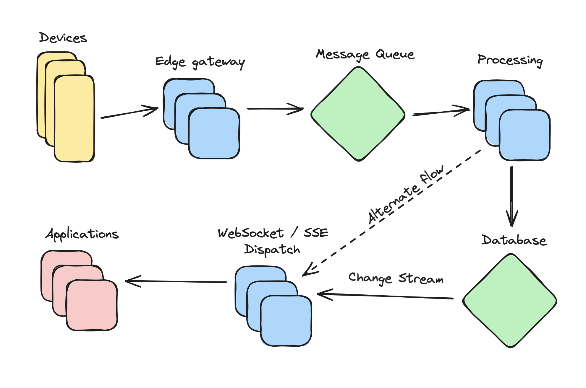

## Question 1

To run:

1. Ensure NodeJS is installed
2. `npm i`
3. `npm run dev`

Open [http://localhost:3000](http://localhost:3000)

This is a [Next.js](https://nextjs.org/) project bootstrapped with [`create-next-app`](https://github.com/vercel/next.js/tree/canary/packages/create-next-app)

The database is persisted locally at `db/`

## Question 2

To make this application production ready, at least the following would need to be done:

- Clarify requirements

    There is some ambiguity in the prompt, eg. the desired behavior for editing temperatures.
  
- Data modeling review
 
    The data model should be revisited with respect to requirements and robustness.  Some possible changes are using a history-preserving mutation log, normalizing datetime representations including timezone, etc.

- Production storage

    Storage should be moved to a production grade database eg. Cloud SQL, etc.
    
- True backend

    Likely, a true backend API service should be implemented instead of implementing it on the frontend server.
    
- Authentication and authorization

- Security review

- Monitoring

- Deployment / rollback strategy
 
- Production frontend

    Design and component implementation and / or integration of an existing design system.
    
- Pagination

    Depending on scale, data pagination could be required.
    
- Improve UX
    - Loading state
    - Error handling
    - Outlier handling

## Question 3

The problem of integrating realtime data from distributed devices is generally related to horizontally scaled ingestion into some kind of event stream, processing / persistence of event data, and consumption of the data by applications. Depending on latency requirements, intermediate steps between the data sources and ultimate consumers could potentially be removed. Here I'll give a solution which strikes a balance between robustness and latency.

We assume a solution needing arbitrary horizontal scalability. GCP infrastructure descriptions should be taken with a grain of salt, because I haven't used GCP in a few years.

The edge gateway can be implemented via a GKE cluster, the message queue via PubSub, the message processing via Dataflow, the database via Firestore or Cloud SQL, and the WebSocket / SSE dispatch again via a GKE cluster. The inclusion of the database change capture may be unnecessary. Another PubSub intermediary may also be needed somewhere between Dataflow and the event dispatch.
